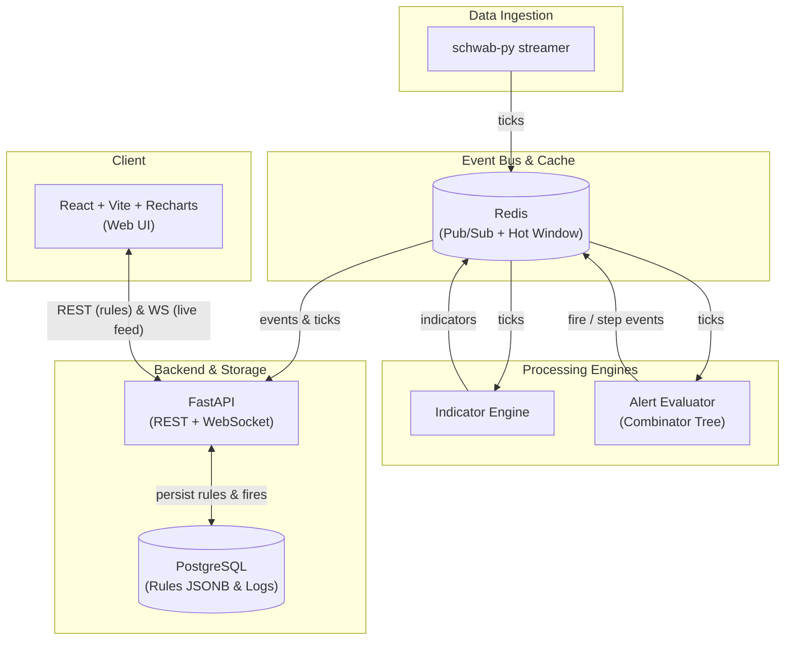

> **Try it above.** Pick a symbol from the watchlist, set up an alert, and watch the beam land on the chart when the condition trips.

## Why I built it

Most consumer trading apps give you one kind of alert: "price crosses X." That's barely an alert. By the time the line gets crossed, half the people watching have already seen it coming and either acted on it or moved on. The notification arrives at the moment it stops being useful.

The signals I actually care about are compound. "This stock has held above its 50-day moving average for three sessions AND volume just spiked above 2× average." Or take the one that finally pushed me to build something: "RSI hits 70, then within 15 minutes price pulls back to the 20EMA and holds." That second one isn't a threshold. It's a small state machine. The first part arms the alert. The second part fires it. If the second part doesn't happen in time, the alert quietly disarms and resets.

I looked around. The expensive professional terminals can do this and a thousand other things I'll never use, for the price of a small mortgage payment per month. The consumer apps give you a price threshold and a notification banner. Nothing in the middle treated compound conditions as a first-class thing without me wiring up a Jupyter notebook every morning.

So I built it. AND / OR / THEN nodes over snapshot predicates, with a separate evaluator for the temporal sequences. The UI surfaces in-flight THEN alerts so I can see what's armed long before the actual fire. Armed means a setup is forming: the first leg has triggered and the clock is ticking. The whole point is to get a heads-up that something's about to happen, not a receipt for what already did.

The visual language is "lights of death." Each fire is a beam dropped onto the chart at the price and time it triggered, color-coded by the rule that produced it. The watchlist landing page shows me, at a glance, which symbols have something cooking: armed alerts, recent fires, sequences mid-flight.

## How the alert combinator works

The core abstraction is a tree of nodes:

- **Predicate:** a snapshot test like `RSI > 70` or `price > 50MA`
- **AND / OR:** composes child nodes against the same snapshot
- **THEN:** a temporal sequence where child A must fire, then child B must fire within a window

The evaluator splits cleanly along that line. Snapshot logic for AND / OR is pure and runs on every tick. THEN sequences are stateful and live in a separate evaluator that tracks armed timers and disarms on timeout. That separation is what makes the whole thing tractable to reason about. It's also the seam that lets the same UI run against any source of ticks. Every view in the app consumes `(snapshot, alerts) → events`. Swap the feed underneath and nothing on top has to change.

## Architecture

Redis is the bus. Ticks land there, multiple subscribers fan out, and the alert evaluator and the indicator engine both read from it. Postgres holds the alert definitions, with the combinator tree serialized as JSONB, plus the history of every fire and every state transition. So I can ask "what triggered that beam at 11:43 yesterday" weeks later and get a real answer.

The frontend is React + Vite + recharts, talking to FastAPI over REST for rules and history and over WebSocket for live ticks and fires.

## Stack

- **Frontend:** React + TypeScript + Vite + recharts
- **API:** FastAPI, REST + WebSocket
- **Engine + evaluator:** Python services, separate from the API
- **Bus + hot window:** Redis pub/sub
- **Persistence:** Postgres (JSONB for alert trees, event log for fires)
- **Market feed:** schwab-py streaming

## Where this is going

The plan is to be a Bloomberg terminal for retail traders. Bloomberg costs around $24K a year per seat and is built for desks that move billions. Robinhood is built for people who want a red button and a green button. There's an enormous middle that nobody serves: retail traders who manage their own money, read 10-Ks, run their own strategies, and want real tools without paying institutional pricing for capabilities they'll never touch.

Compound alerts are the first piece. The rest of it is the same problem solved one piece at a time: unified news, fast charts, watchlist intelligence, eventually order routing. Lighthouse is what I want that tool to look like.
